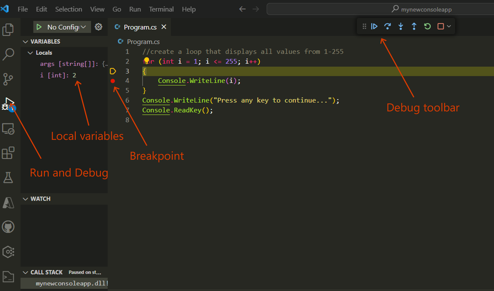

# .NET lab

## Prerequities
1. Visual Studio Code.
2. C# Extension in Marketplace. 
3. The latest .NET 7.0 SDK.


## Step One - understanding .Net 
Cover:
1. What is .Net?
   [here](https://learn.microsoft.com/en-us/dotnet/core/introduction)
3. Looking back in history.
4. Let's look at the features.

## Step Two - build your first app 
Build a simple console app in your local copy of Visual Studio Code, then build and run your application locally. 

Steps:
Following the plan [here](https://learn.microsoft.com/en-us/dotnet/core/tutorials/with-visual-studio-code?pivots=dotnet-7-0)
1. In VS Code, open a Terminal Window.
2. Ensure you're in the directory that you want to be, if not change with cd c:\<mydir>
3. Run: 
   ```
   dotnet new console -o mynewconsoleapp
   ```
5. Open the folder that contains your app in VS Code.
6. Take a look at the code in "Program.cs".
7. Replace the code with the following:
  ```
   for (int i = 1; i <= 255; i++)
   { 
        Console.WriteLine(i); 
   }
   Console.WriteLine("Press any key to continue..."); 
   Console.ReadKey(); 
   ```
9. Save the code. 
10. Then run again.

## Step Three - debug the app
We'll now add a breakpoint and debug the app. 

Steps:
Following the plan [here](https://learn.microsoft.com/en-us/dotnet/core/tutorials/debugging-with-visual-studio-code?pivots=dotnet-7-0)
1. In the Program.cs file add breakpoint to "Console.WriteLine(i);"
2. Select Run and Debug from the left side menu.
3. Select Step Into in the Degub Toolbar.
4. Watch the variables in the Local Variables.



## Step Four - list all templates 
We'll list all the templates avaiables in .Net. 

Steps:
1. Run in the Terminal:
   ```
   dotnet new list
   ```
3. Take a look at the different types of templates. 

## Step Five - build a web app 
Build again in VS Code.  
This app will be used in the next session. 

Steps:
Following the plan [here](https://dotnet.microsoft.com/en-us/learn/aspnet/hello-world-tutorial/intro)


## Stretch goal ideas
1. Build in Visual Studio.
2. Build a Blazor Web Assembly app.

