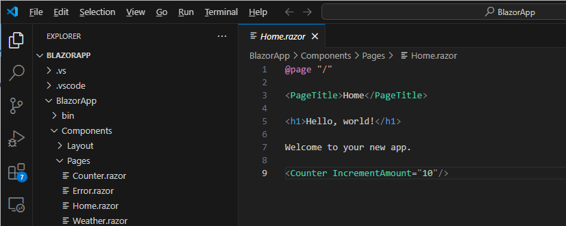

# Cloud Native/App Service lab
Following the plan [here](https://learn.microsoft.com/en-us/azure/app-service/quickstart-dotnetcore?tabs=net70&pivots=development-environment-vscode)

## Prerequities
1. An Azure account with an active subscription.
2. Visual Studio Code.
3. The Azure Tools extension.
4. The latest .NET 7.0 SDK.

## Step One - understanding web apps
Summarising from previous slide decks:
1. App Service is the umbrella terms of web apps, web app for containers, APIs etc.
2. Platform as a service (PaaS)- a managed service
3. Fastest way to get some web capability running
4. App Service cares little about the app's programming language or runtime (Windows vs. Linux)
5. TLS out of the box (not so with all other compute services)
6. Deploying the web app and deploying its code are two separate things - each with their own lifecycle. Deploying the code must be after the web app and is usually done much more frequently.

## Step Two - verify your app can run locally
This should be done in your local copy of Visual Studio Code and should be covered from the previous session. 
Make sure your application is up and running locally.

**This should be the only web app from step five of the previous session.**

## Step Three - create a web app in the portal
This step is peformed in the Azure portal.

Steps:
1. type "web app" in the search part of the portal
2. Choose the "App Services" item in the search results

3. Choose "Create" then "Web App"

   
4. You should then choose some suitable values for the web app. The name must be unique. 

Things to think about:
* It's name
* Resource Group
* Region
* Service plan - Windows or Linux and SKU
* Runtime

5. Hit the "Create" button and then wait a few minutes.

You should now have a web application in the portal. This is now a public-facing live web site with the URL https://YOUR_WEB_APP_NAME.azurewebsites.net.

Try putting that in a browser session (with your web app name). You should see something like this:

If this is the case, then the web app exists and is running. All we have to do now it to put our own code on the web app so that it is a real application.

## Step Four - Deploy/Publish from VS Code to the web app
This step is back in Visual Studio Code (VS Code).

In this step we are going to deploy directly from VS Code. In production, this would not normally done this way, but would be done in some automated manner in the likes of GitHub or Azure DevOps. This will be a later lab.

However, it is sometimes useful to directly deploy from VS Code.

Your copy of VS Code should already have the application code and also should have an "Azure" extension installed.

The Azure extension needs to be logged onto your Azure subscription.

Once logged on, pick your Azure subscription - if there is more than one in the list. You should see a list of services that the extension can work with:

Open the "App Services" one with the ">" arrow:

You may need to install an extension onto the web app in order to allow deployments. So, if you see

Then click on this and install:

Now you should be able to choose the web application you created in a previous step and right-click. There should be a pop-up menu which includes the choice *Deploy to Web App* pick this and follow the instructions.

Now validate that the code has been successfully deployed by checking on your web app URL again. As a reminder, it is of the format:

https://YOUR_WEB_APP_NAME.azurewebsites.net

So now you know what the code for an ASP.NET web application looks like and how to debug locally and now how to get this web application on Azure. It's exaclty the same for web APIs. Next step is making a change and redeploying.

## Step Five - Make a change and redeploy
1. In VS Code - make a change to one of the headers in your application
2. Test this locally to validate this has the intended effect.
3. Go to the Azure Extension, find your web app again and then right-click and redeploy.
4. Wait until completion and validate using the URL

If you created a web app with **dotnet new webapp -o MyWebApp --no-https -f net7.0**, then you can change some of the text in **Index.cshtml**

could be changed to:

Don't forget to save the change (Ctrl-S). Then right-click the web app and "Deploy to web app" again.

This is the process that often happens in a development lifecycle - multiple deploys of new versions of code to an existing web app.

What if there were concerns that mistakes could be made? How can I validate this on Azure and how can I deploy safely and potentially revert a change. This is a challenge for most organisations. Web apps have a feature which can help. See the stretch goal step later.

## Step Six - web app for containers
Web apps can also run Docker containers. Here's how to deploy one.

1. Choose web app for containers or Create the web app, but choose "Docker Container" Option:

3. Move to the Docker tab and set some values:

The above settings are really important. You may observe that the password is redacted. We will supply that. If this is not correct, the app will not be able to pull the container image.

ServerURL: https://jjacreg.azurecr.io

Username: jjacreg

Image: recipe:latest

Password: utNyqU0rPfT5av11ibd0tBV2/4IrQ8h57ykh+EnML1+ACRDOu5 - which is truncated by two characters. The team will let you know.

3. Hit create and wait.

4. Open the web app URL - you should see something like this

and have a go!

## Step Seven - stretch goal - Deployment Slots
[Deployment slots](https://learn.microsoft.com/en-us/azure/app-service/deploy-staging-slots?tabs=portal) or staging environments is a feature that allows the a web application to have a main slot and other slots. In general, customers chose one other slot and name it "staging".

The idea is that deployments will not be made to the main application - but to the staging slot. This will have a name of the form:

https://YOUR_WEB_APP_NAME-YOUR-SLOT-NAME.azurewebsites.net.

You can then test the application on this slot and when ready "slot swap". This is a feature of a web app that has a deployment slot, where the roles of the main and the staging slot get swapped.

As can be seen above, the staging and main are about to be swapped. Once this is completed a new version of the application will be on the main URL of the web app. The beauty of this approach is that if issues are subsequently found, then the swap can be performed again to reverse the effect of the change - giving a customer the ability to easily rollback any change to their web app.

The golden rule of such an approach is to only deploy to the staging slot.

Try it out!

** Deployment slots are only available on some app service SKUs. If this feature is not available, then change the SKU of the app service plan to a "standard" SKU e.g. S1.

## Further learning and labs
Here is a list of useful destinations in our documentation for learning more about deploying apps on Azure.

### App Services
[App Service Documentation](https://learn.microsoft.com/en-us/azure/app-service/)

[Deploy an ASP.NET web app](https://learn.microsoft.com/en-us/azure/app-service/quickstart-dotnetcore?tabs=net70&pivots=development-environment-vscode)

[Deploy a Python web app to Azure App Service](https://learn.microsoft.com/en-us/azure/app-service/quickstart-python?tabs=flask%2Cwindows%2Cazure-cli%2Cvscode-deploy%2Cdeploy-instructions-azportal%2Cterminal-bash%2Cdeploy-instructions-zip-azcli)

### AKS
[AKS Documentation](https://learn.microsoft.com/en-us/azure/aks/)

[AKS Quickstart: deploy AKS and a sample app](https://learn.microsoft.com/en-us/azure/aks/learn/quick-kubernetes-deploy-portal?tabs=azure-cli)

[AKS Quickstart: deploy an app with Helm](https://learn.microsoft.com/en-us/azure/aks/quickstart-helm?tabs=azure-cli)

### Container Apps
[Container Apps documentation](https://learn.microsoft.com/en-us/azure/container-apps/)

[Quickstart: Deploy your first container app](https://learn.microsoft.com/en-us/azure/container-apps/quickstart-portal)

