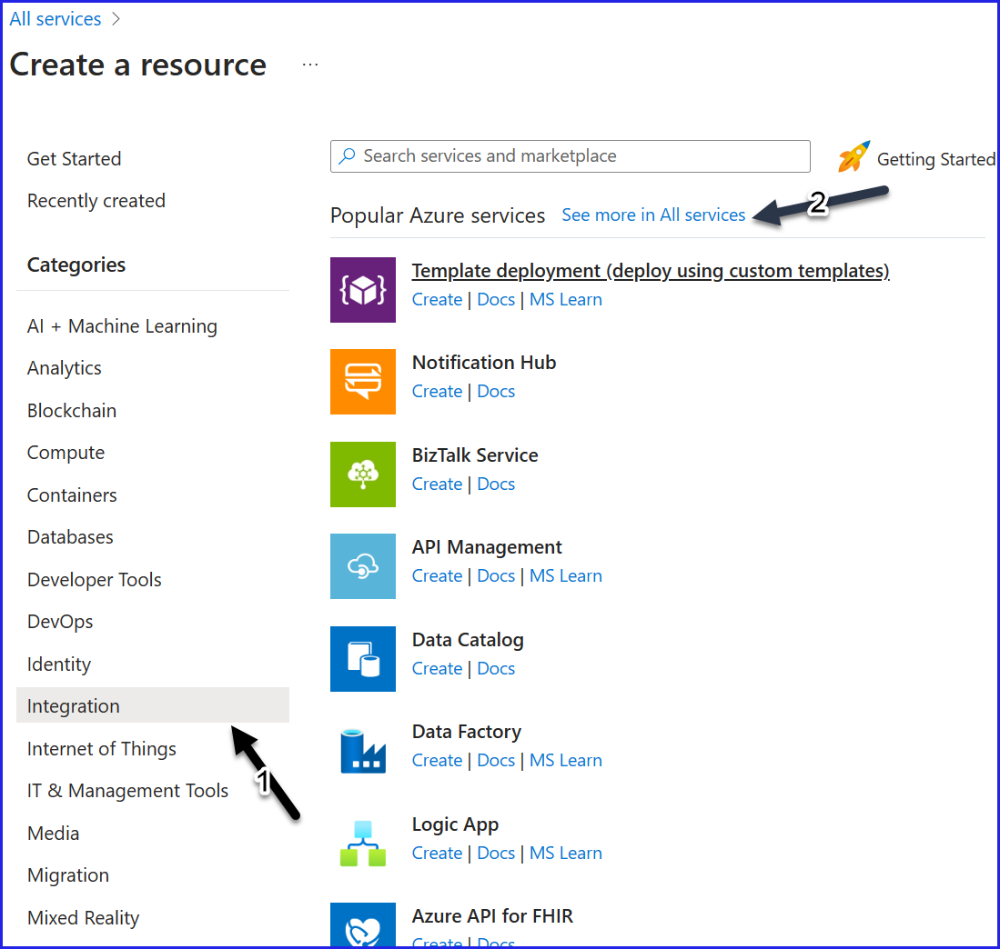
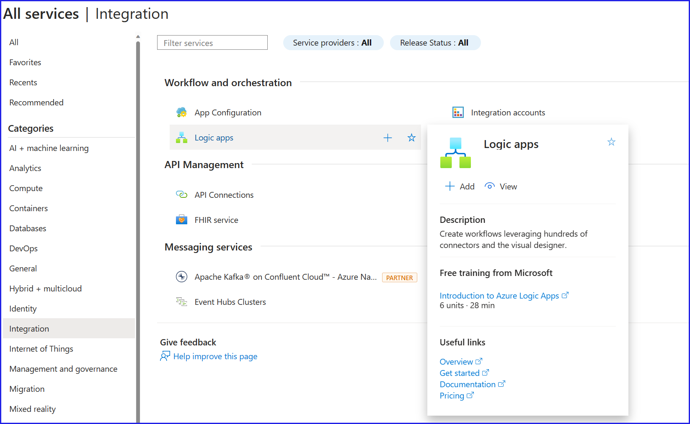
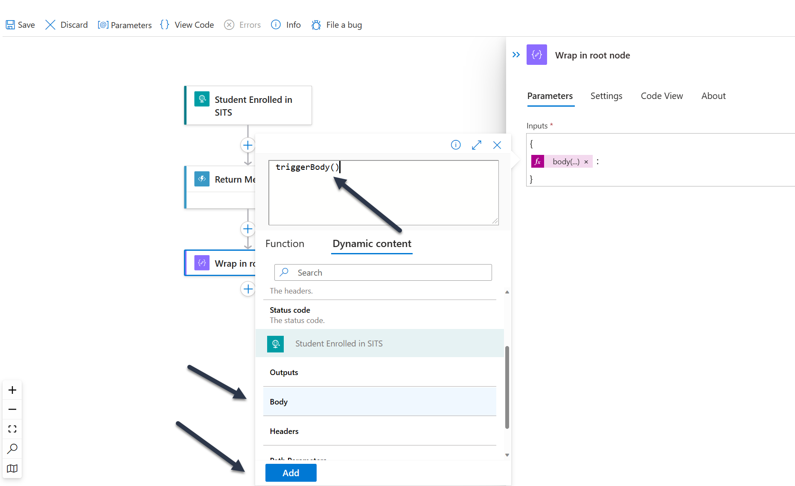
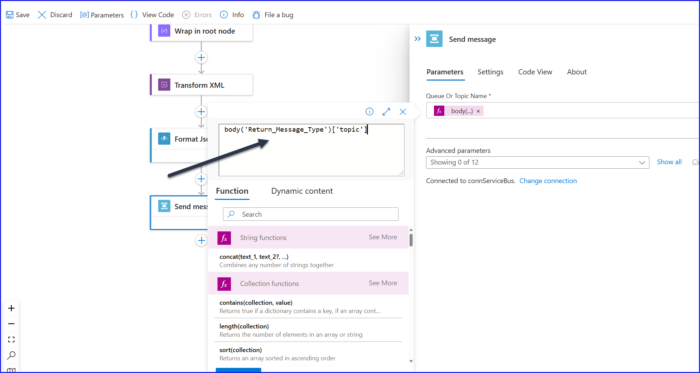

# Integration/Logic App lab 


# Step 0 - Create Resource Group

1. Navigate to Azure Portal and create a Resource Group.

  >  Resource Group Name : rg-eic-integration-<initials>\
  >  Resource Group Location : westeurope


# Step 1 - Create Service Bus Namespace and topics


1. Clone the AppDevLearning repo to your local folder, and open it in VS Code.

1. On the VS Code, navigate on the top menu and click on View.
1. Click on Terminal, which should open a terminal window at the bottom pane - where you can run cli commands\
1. In the terminal window, navigate to the path exercisefiles\integrationworkshop\bicep
1. Login to Azure if you haven't already done so previously
    ```
    az login  
    ```
1. From here you can run the following command, which will create the Service bus namespace, topics and subscriptions. 
    ```
    az deployment group create --resource-group <rg name> --template-file servicebus.bicep --parameters servicebus.bicepparam  
    ```
1. Once the command is succesful, you can navigate to the Azure Portal, and check in the resource group that a new service bus namespace has been created, and that it has the topics and subscriptions.

# Step 2 - Create Azure Functions
1. Using the same Terminal window, you can run another cli command as shown below which will create the Azure function app.
    ```
    az deployment group create --resource-group <rg name> --parameters functions.bicepparam
    ```
1. Navigate to the Azure Portal, and check that Function App resource has been created for you.

1. Within this function app, we will create 2 Azure Functions within this Function App, which we will call as 1) MessageType and 2) FormatJSONPayload

1. To create the first Azure Function, from the overview page of the FunctionApp, click Create on Portal as shown below.

    

1. Select a HttpTrigger template, and change the name to **MessageType** as shown below. Click Create, which will create the http triggered function for you, with some default code inside it.


    

1. Once the MessageType function is created, click on the code+test tab as shown below.

1. The code what you see here is the default code when you create a httptrigger function. Lets replace that with the code with prewritten code for you.
  
1. This function will determine if the incoming message type, and will spit out the xslt map name to be used, service bus topic on which this message should be published etc. This way, we are making these dynamic integrations, where we decide based on the incoming message, which map will be used and where will it go in the service bus.
   
    

1. To replace the code - navigate to Appdevlearning/exercisefiles/integrationworkshop/functionscode/messagetype.csx

1. Copy the code which is in messagetype.csx file in its entirety and paste it over the default code which it generated.

1. It should look something like this, after you finish pasting this code.
  

     

1. Now to create the second Azure function, follow the same steps as you created the first Azure Function. Name it **FormatJsonPayload**, and copy paste the code from the formatjsonpayload.csx file.

1. At the end of the this step, you should have 2 functions called MessageType and FormatJsonPayload within your function app.

     

**Optionally you can test the function app from the portal as well.**

# Step 3 - Create Logic App

1. Next step is to create a logic app. This is where we will be writing the integration steps, using a visual tool called logic apps designer. At the end of step 3, you should see a logic app which will look like this. 
  
    

1. Start creating a logic apps resource under the same resource group which we have been using
1. The following few screen shots should help you create a logic app
  
     
     
     
     
     
     
     
     
    

1. Now that the logic app is created, which like function app, is a hihg level construct under which we can create multiple workflows (just like how you can create multiple functions within a function app)

1. We will be using XSLT mapping in our workshop, and these XSLT files are precreated for you. You can find them under integrationworkshop/xsltmapping folder in this repo. 

1. As shown below, please upload the 4 xslt files to maps tab as shown below. We will use these xslt maps when defining the integration in the next steps.
  
    
   
1. Let us now create a new workflow under the logic app resource you have created. The following screen shots will help you in this process. 


    

1. Give a meaningful workflow name, and mark it as stateful. Hit the create button
  
    
1. Once the workflow is created for you, you can click on the designer tab, which is the visual designer which we will be using for developing our logic apps. If you have used PowerAutomate before, some of these will be familiar for you
1. First step in the logic app is the Trigger of that workflow. We will use a http request triggered workflow.
  
    
    
1. Rename the http request to something meaningful like "Student Enroled in SITS"
  
    

1. Next step is to add a Action to call one of the Azure functions we have created before.Let's rename this action to **Return Message Type** - Using the following screen shots, you can add this Azure function action, and create a connection string to call the **MessageType** function we created earlier.
1. We will be passing the same message which came in to the http request to the Azure function, along with sending 2 header values messagetype and operation, which are incoming from the http request as well.
  
    
    
    
    

    test
    
    
    
    

1. Lets add the next action to our workflow, which is a compose Action - this is to wrap the incoming json message with a overall root node. This is needed, as we will be converting this json message into xml in the following steps - and xml conversion will expect a overall root node. The exact name of the root node to be wrapped will be returned by the Return Message Type
    
    

    

1. Let's rename this action as **Wrap in root node**
    
1. For the inputs, we need to create a json as shown below. so we start with 2 curly brackets, and then use the wrapper element and the actual body of the message. 
    ```json
    {
      "name":"value"
    }
    ```
    
    
1. Let's add the next shape into our workflow, which is to Transform the XML message from one format to another. We will use an action called Transform XML as shown below.
  
    

1. Because Transform XML works with xml message, we need to convert the json file which we have to xml. Logic apps have built-in functions to do such conversions, one of them is called xml(), which will convert the object passed into XML. We will use this function to convert.
  
    
1. We will dynamically use a map based on the incoming message, as determined by the returnmessagetype. Put an .xslt extension at the end of the file
    
1. Time to add the next action, which is again calling the second function which we created called FormatJsonPayload. This function will take the incoming json, and formats, indents and sends the message back.
 
    
1. Make sure you are using a new connection string for this Function call, as you want to call the FormatJsonPayload. At the bottom of the shape, you can see "change connection" - click on that
    
1. Time to add the next action in our workflow, which will be to send the message to Service Bus
1. You need to create a connection string to the service bus. To get the connection string for the service bus, refer the screen shot which states Serice Bus connection string.
 
    
    

   **Service Bus Connecting String**

    
    
    
    
    

# Step 4 - Send Request from Postman

Now that you have completed developing logic app, its time to test it by passing on a message.

We will use postman to mimic the student enrolled in SITS and a request coming into Azure.

I have created sample files for you to test - Integrationworkshop/testfiles.

Using postman you can start creating requests to test the logic app. 
