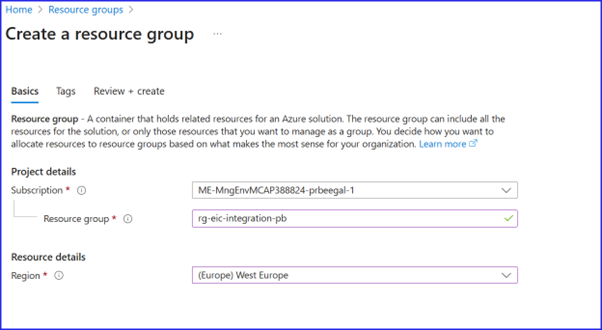
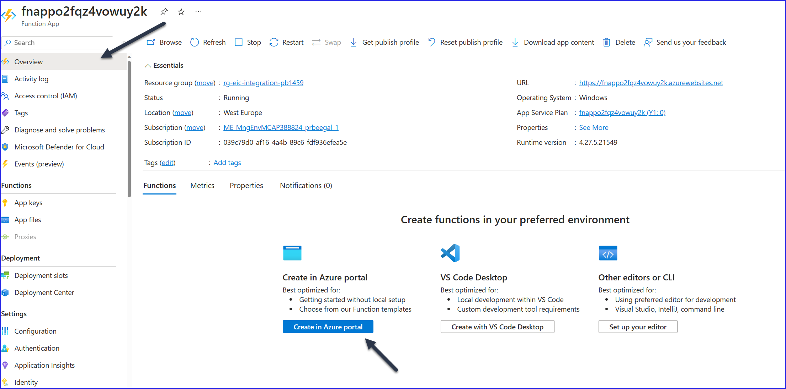
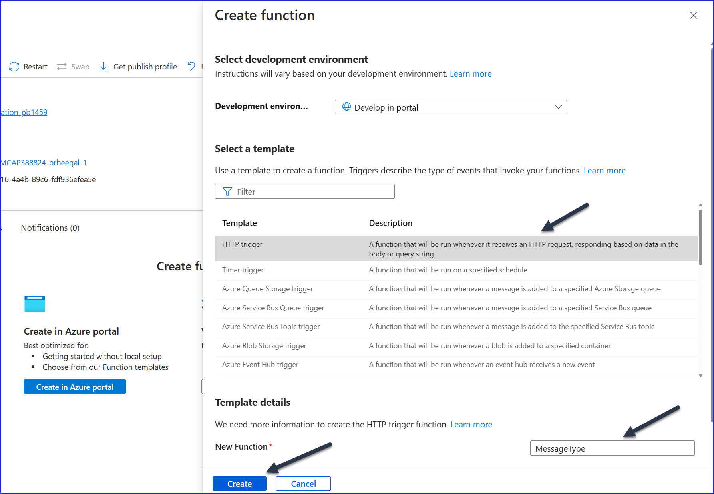
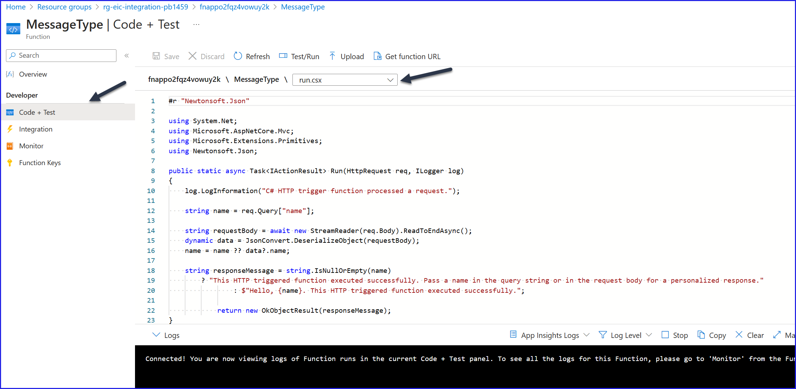
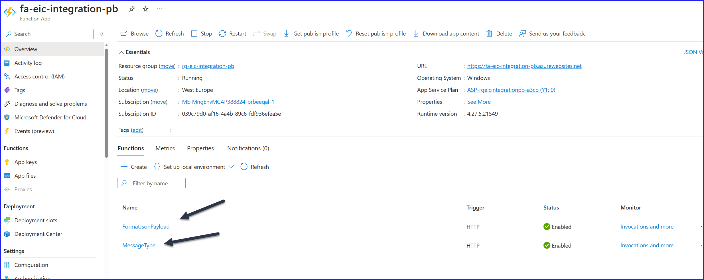

# Integration/Logic App lab 

# Step 0 - Create Resource Group
Install Bicep extension in VS code.
Navigate to Azure Portal and create a Resource Group.\

  >  Resource Group Name : rg-eic-integration-<initials>\
  >  Resource Group Location : westeurope

# Step 1 - Create Service Bus Namespace and topics

Clone the AppDevLearning repo to your local folder, and open it in VS Code.

On the VS Code, navigate on the top menu and click on View.
Click on Terminal, which should open a terminal window at the bottom pane - where you can run cli commands

az version
az deployment group create --resource-group <rg name> --parameters servicebus.bicepparam  

This will deploy the servicebus namespace and the required queues, topics and subscriptions. 

Navigate to the Azure Portal, and check in the resource group that a new service bus namespace has been created, and that it has the topics and subscriptions.

# Step 2 - Create Azure Functions
From the same terminal window, run the following command to deploy Azure Functions.

az deployment group create --resource-group <rg name> --parameters functions.bicepparam

Navigate to the Azure Portal, and check that Function App resource has been created for you.

We will now create 2 Azure Functions within this Function App, which we will call as 1) MessageType and 2) FormatJSONPayload

To create the first Azure Function, from the overview page of the FunctionApp, click Create on Portal as shown below.

Select a HttpTrigger template, and change the name to MessageType as shown below. Click on Create. 

Once the MessageType function is created, click on the code+test tab as shown below.

The code what you see here is the default code when you create a httptrigger function. Lets replace that with the code which we want. I have prewritten this code for you. 

Within your repository, navigate to Appdevlearning/exercisefiles/integrationworkshop/functionscode/messagetype.csx

Copy the code which is in messagetype.csx file in its entirety and paste it over the default code which it generated.

It should look something like this, after you finish pasting this code.
 

Now to create the second Azure function, follow the same steps as you created the first one. Name it FormatJsonPayload, and copy paste the code from the formatjsonpayload.csx file.

At the end of the this step, you should have 2 functions called MessageType and FormatJsonPayload within your function app.

 

Optionally you can test the function app from the portal as well.
 
# Step 3 - Create Logic App

# Step 4 - Send Request from Postman
